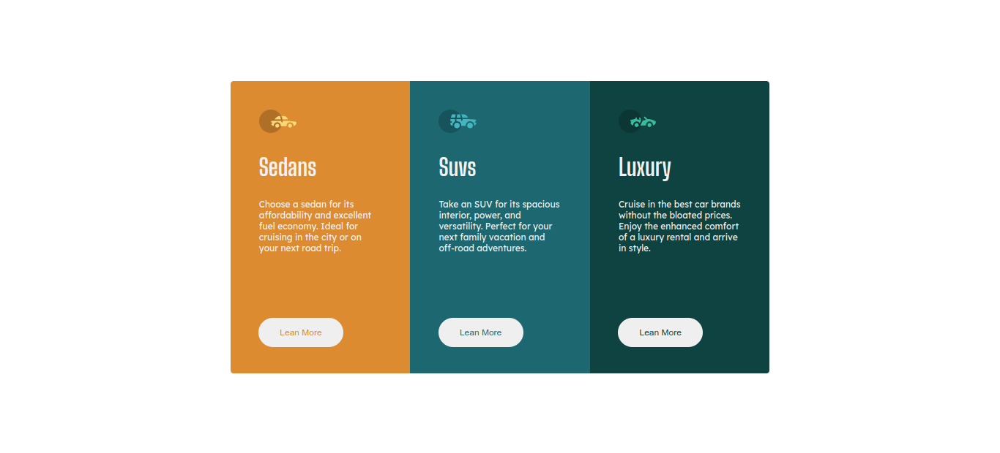
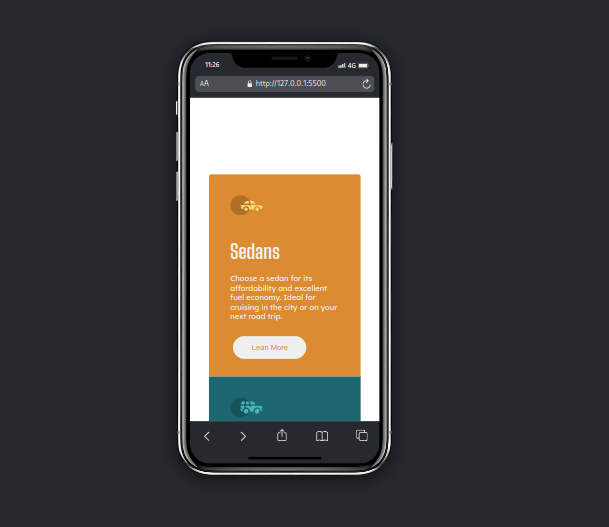
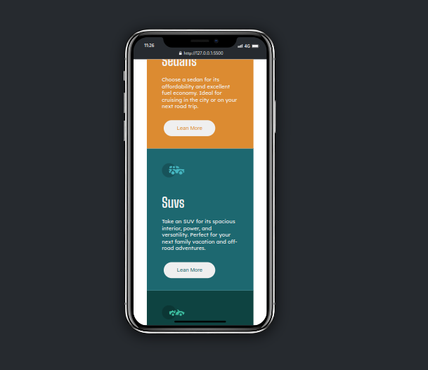
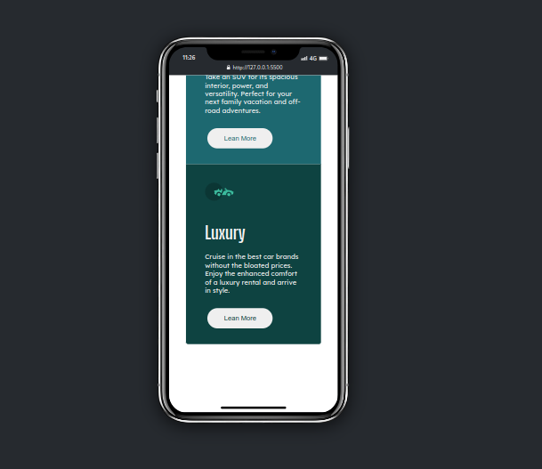
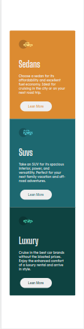

# Olá meu nome é Rafael👋👋👋.

# ===================================== 

## 3 Column Preview Card Component | Base | 2023/02/22
No momento estou preparando o ambiente para programar o desafio, logo vou fazer o projeto para desktop;

### Font(s):

[Lexend Deca](https://fonts.google.com/specimen/Lexend+Deca)
- Weights: 400

[Big Shoulders Display](https://fonts.google.com/specimen/Big+Shoulders+Display)
- Weights: 700

### Paletas de Cores:

- Bright orange: hsl(31, 77%, 52%)
- Dark cyan: hsl(184, 100%, 22%)
- Very dark cyan: hsl(179, 100%, 13%)
- Transparent white (paragraphs): hsla(0, 0%, 100%, 0.75)
- Very light gray (background, headings, buttons): hsl(0, 0%, 95%)

# ===================================== 

## 3 Column Preview Card Component | Desktop | 2023/02/22
Já terminei a base desktop, não foi dificil de usar os elementos do Html, tanto que não to usando tanta div estou usando outros elementos para está função, também estou usando pouca linha de codigo para programar no Css;

# ===================================== 

## 3 Column Preview Card Component | Mobile | 2023/02/23
Finalizei a parte responsiva do site usei tamanho min-width 320px e max-widt 1000px, assim não vai ter erro se um celular for tamanho 900px etc... , tirei algumas fotos dele com celular e inteiro, foi um pouco dificil de mexer com a parte de tamanho pois é primeira vez que mexo com tamanho muito grande, espero que gostem, esté é o projeto final do desafio;

# ===================================== 

### Meu Insta🌐: https://www.instagram.com/rafael.timoteo.r.h/